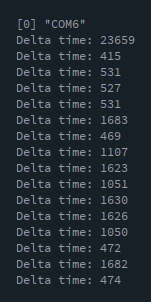
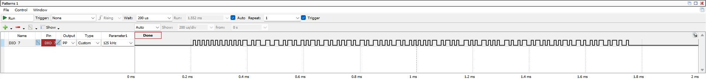

# Projet electronique

## Dans source keil

Le code pour le projet keil, attention a bien ajouter tout les fichiers sources *.c et *.h>
**Note:** dans keil, les dossiers / sous-dossiers ne sont pas affiché mais ils sont bien pris en compte.

### Organisation du code

Normalement, il n'y a pas a modifier du code code autre que dans le **main.c**, les autres fichiers sont des utilitaires. 

#### Dossier FIFO

Utilitaire pour la gestion d'un buffer circulaire type FIFO, avec des fonctions pour lire, ecrire et verifier l'espace disponible.

#### Dossier host communication

Utilitaire de communication avec le PC host. Utilise l'UART 2 (qui est redirigé sur la prise mini USB).

Lors de l'initialisation, instancie une FIFO pour stocker les données à envoyer.
Pour envoyer des données, il existe une fonction pour envoyer un nombre hexa, et une autre pour envoyer une chaine de caractere.

**Note:** Pour lire les chaines de caracteres il faut utiliser le procssing et le fichier source de **src_processing**

Enfin la fonction **hostComUpdate** doit toujours être dans la boucle principale, elle enovie un nouveau caractere dès que la ligne est disponible.

#### Utils

Fonctions pour initialiser les GPIOA et GPIOB

#### Main

Contient le code d'initialisation et d'utilisation de l'input capture.

## Dans source processing

Contient un code pour processing pour lire sur le port serie. Le code permet de lire les chaines de caracteres envoyé par le STM32.

L'output de processing:

## Dans simu data

Contient un échantillion de code manchester à utiliser pour les tests avant de tester avec le PCB.

Pour configurer waveform:

